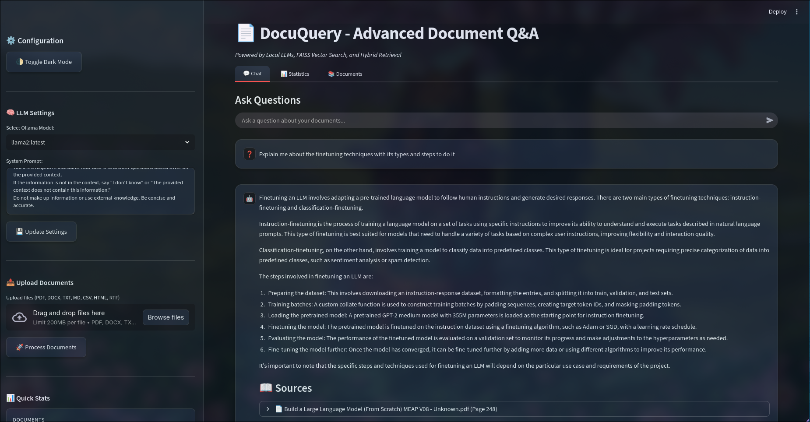

<p align="center">
  
</p>

# 📄 DocuQuery - Local Document Q\&A with Ollama + FAISS

**DocuQuery** is a local-first, privacy-focused document-based Q\&A assistant built using:

* 🔍 FAISS for semantic search over your uploaded PDFs and DOCX files
* 🧠 Local LLMs via Ollama (e.g., `phi3`, `gemma`, etc.)
* 🗂 LangChain for chunking, prompt engineering, and RAG chains
* 💬 Streamlit interface for seamless question answering

---

## 🚀 Features

* Upload and process PDFs/DOCX files
* Ask natural language questions based on your documents
* View answers with source references
* Get summaries from the PDFs
* Choose from multiple local Ollama models
* Customize the LLM’s system prompt
* Full vector store persistence across sessions
* Clear/reset knowledge base and conversation history

---

## 💠 Installation

1. **Clone the repository:**

```bash
https://github.com/ndeekshith/DocuQuery.git
cd DocuQuery
```

2. **Create a virtual environment & install dependencies:**

```bash
pip install -r requirements.txt
```

3. **Install and run ********[Ollama](https://ollama.com/)********:**
and required models as per your need
```bash
ollama serve
ollama pull phi3
```

4. **Run the app:**

```bash
streamlit run app.py
```

---

## 🧠 Available Models (via Ollama)

You can use any installed Ollama models like:

* `phi3:3.8b-mini-4k-instruct-q5_K_M`
* `gemma2:2b`
*  or any custom models supported by Ollama

---


---

## ⚠️ Notes

* Make sure `Ollama` is running on `localhost:11434`
* All data and models are processed locally – no external APIs required
* Ideal for offline, secure environments

---

## 📜 License

MIT License

---
