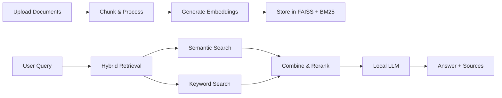

<p align="center">
  
</p>

<p align="center">
  <a href="#quickstart"></a>
  <a href="#features"></a>
  <a href="LICENSE"></a>
  <a href="#contributing"></a>
</p>

# 📄 DocuQuery v2.0 — Advanced Local Document Q&A

> **Privacy-first, AI-powered document intelligence that runs entirely on your machine.**

DocuQuery is a production-ready, local-first document Q&A system that combines state-of-the-art retrieval techniques with local LLMs. Built for privacy-conscious users who need powerful document analysis without sending data to the cloud.

## ✨ Key Features

### 🔎 **Intelligent Hybrid Search**
- **Semantic Search**: Dense vector retrieval using FAISS with sentence-transformers
- **Keyword Search**: BM25 algorithm for exact term matching
- **Smart Reranking**: Cross-encoder reranking for precision
- **Configurable Weights**: Fine-tune semantic vs. keyword balance

### 🧠 **Local LLM Integration**
- Powered by Ollama - no API keys, no cloud dependencies
- Support for multiple models: phi3, llama3, mistral, gemma, and more
- Customizable system prompts and temperature settings
- Streaming responses for real-time feedback

### 📚 **Universal Document Support**
- **Formats**: PDF, DOCX, TXT, MD, CSV, HTML, RTF
- **Smart Chunking**: Configurable chunk size and overlap
- **Batch Processing**: Async document processing for speed
- **Metadata Tracking**: SQLite database for document management

### ⚡ **Performance Optimized**
- **Async Processing**: Multi-threaded document ingestion
- **Embedding Cache**: Avoid recomputing embeddings
- **IVF Indexing**: Optional for 100k+ document collections
- **CPU Optimized**: Runs efficiently without GPU

### 🎨 **Modern User Interface**
- **Dark/Light Themes**: Full theme support across all components
- **Streaming Answers**: Real-time response generation
- **Source Highlighting**: Query term highlighting in sources
- **Document Management**: Upload, preview, and delete documents
- **Statistics Dashboard**: Track usage and performance metrics

### 🐳 **Production Ready**
- **Docker Support**: One-command deployment with docker-compose
- **Configuration Management**: YAML-based config with sensible defaults
- **Structured Logging**: Rotating logs with configurable levels
- **Health Checks**: Built-in monitoring endpoints
- **Test Coverage**: Comprehensive pytest suite

---

## 📑 Table of Contents

- [Screenshots](#-screenshots)
- [How It Works](#-how-it-works)
- [Architecture](#-architecture)
- [Prerequisites](#-prerequisites)
- [Quickstart](#-quickstart)
  - [Local Installation](#local)
  - [Docker Deployment](#docker-compose)
- [Configuration](#-configuration)
- [Usage Guide](#-usage-guide)
- [Advanced Features](#-advanced-features)
- [Performance Benchmarks](#-performance-benchmarks)
- [API Reference](#-api-reference)
- [Troubleshooting](#-troubleshooting)
- [Development](#-development--testing)
- [Contributing](#-contributing)
- [FAQ](#-faq)
- [License](#-license)

---

## 📸 Screenshots

<details>
<summary>Click to view screenshots</summary>

### Chat Interface

*Ask questions and get AI-powered answers with source citations*

### Document Management

*Upload, preview, and manage your document collection*

### Statistics Dashboard

*Track document counts, embeddings, and system metrics*

### Dark Mode

*Full dark mode support across the entire application*

</details>

---

## 🔄 How It Works



**The Pipeline:**

1. **Document Ingestion**: Upload documents → Extract text → Split into chunks
2. **Embedding Generation**: Convert chunks to dense vectors using sentence-transformers
3. **Index Building**: Store vectors in FAISS, build BM25 index for keywords
4. **Query Processing**: User question → Hybrid search (semantic + keyword)
5. **Reranking**: Cross-encoder scores and reranks top candidates
6. **Answer Generation**: Local LLM generates contextual answer with sources

---

## 🏗️ Architecture

### Project Structure

```
DocuQuery/
├── app.py                    # 🎯 Streamlit UI entrypoint
├── config.yaml               # ⚙️ Main configuration file
├── requirements.txt          # 📦 Python dependencies
├── Dockerfile                # 🐳 Container image definition
├── docker-compose.yml        # 🚀 Multi-container orchestration
│
├── src/                      # 📂 Core application modules
│   ├── __init__.py
│   ├── config.py             # Configuration loader & validation
│   ├── logger.py             # Structured logging with rotation
│   ├── database.py           # SQLite metadata store (pysqlite3 fallback)
│   ├── document_loaders.py   # Multi-format file parsing & chunking
│   ├── vectorstore.py        # FAISS + BM25 + cross-encoder reranking
│   ├── qa_chain.py           # LLM query pipeline with Ollama
│   └── ui_components.py      # Themed Streamlit components
│
├── tests/                    # 🧪 Test suite
│   ├── __init__.py
│   ├── test_config.py        # Configuration tests
│   ├── test_database.py      # Database operations tests
│   └── test_*.py             # Additional test modules
│
├── data/                     # 💾 Runtime data (auto-created)
│   ├── vectorstore/          # FAISS index files
│   ├── temp_docs/            # Temporary uploaded files
│   ├── embedding_cache/      # Cached embeddings
│   └── documents.db          # SQLite metadata database
│
├── logs/                     # 📝 Application logs (rotating)
│   └── docuquery.log
│
├── models/                   # 🤖 Downloaded model cache
│   └── embeddings/           # Sentence-transformer models
│
└── assets/                   # 🎨 Static assets
    ├── logo.png
    └── screenshots/
```

### Component Architecture

```
┌─────────────────────────────────────────────────────────────┐
│                     Streamlit UI Layer                       │
│  (app.py + ui_components.py)                                │
│  • Chat Interface  • Document Manager  • Statistics         │
└─────────────────────┬───────────────────────────────────────┘
                      │
┌─────────────────────▼───────────────────────────────────────┐
│                  Application Logic Layer                     │
├─────────────────────────────────────────────────────────────┤
│  QAChainManager          │  DocumentLoader                  │
│  • Query processing      │  • Multi-format parsing          │
│  • LLM integration       │  • Text chunking                 │
│  • Prompt management     │  • Async processing              │
└─────────────────────┬────┴──────────────────────────────────┘
                      │
┌─────────────────────▼───────────────────────────────────────┐
│                   Data & Storage Layer                       │
├─────────────────────────────────────────────────────────────┤
│  VectorStoreManager      │  DocumentDatabase                │
│  • FAISS indexing        │  • Metadata storage              │
│  • BM25 search           │  • Document tracking             │
│  • Cross-encoder rerank  │  • Status management             │
└─────────────────────┬────┴──────────────────────────────────┘
                      │
┌─────────────────────▼───────────────────────────────────────┐
│                   External Services                          │
├─────────────────────────────────────────────────────────────┤
│  Ollama (LLM)            │  HuggingFace Models              │
│  • Local inference       │  • Embeddings                    │
│  • Model management      │  • Cross-encoders                │
└─────────────────────────────────────────────────────────────┘
```

### Data Flow

**Document Ingestion:**
```
Upload → Parse → Chunk → Embed → Index (FAISS + BM25) → Store Metadata
```

**Query Processing:**
```
Question → Embed → Hybrid Search → Rerank → LLM Context → Generate Answer → Display Sources
```

---

## 📋 Prerequisites

### Required

| Component | Version | Purpose |
|-----------|---------|---------|
| **Python** | 3.11+ | Application runtime |
| **Ollama** | Latest | Local LLM inference |
| **Disk Space** | 5GB+ | Models + embeddings + data |
| **RAM** | 8GB+ | Recommended for smooth operation |

### Optional

| Component | Purpose |
|-----------|---------|
| **Docker** | Containerized deployment |
| **Docker Compose** | Multi-service orchestration |
| **GPU** | Faster embeddings (not required) |

### Ollama Setup

```bash
# Install Ollama (Linux/macOS)
curl -fsSL https://ollama.com/install.sh | sh

# Or download from: https://ollama.com/download

# Start Ollama service
ollama serve

# Pull recommended model
ollama pull phi3:3.8b-mini-4k-instruct-q5_K_M

# Alternative models
ollama pull llama3        # Higher quality, slower
ollama pull mistral       # Balanced performance
ollama pull gemma         # Google's model
```

---

## 🚀 Quickstart

### Local

```bash
# 1. Clone the repository
git clone https://github.com/ndeekshith/DocuQuery.git
cd DocuQuery/DocuQuery

# 2. Create and activate virtual environment
python -m venv venv
source venv/bin/activate  # Windows: venv\Scripts\activate

# 3. Install dependencies
pip install -r requirements.txt

# 4. Start Ollama (in a separate terminal)
ollama serve
ollama pull phi3:3.8b-mini-4k-instruct-q5_K_M

# 5. Run the application
streamlit run app.py
```

**🎉 Success!** Open your browser to **http://localhost:8501**

### Docker (Compose)

```bash
# 1. Clone the repository
git clone https://github.com/ndeekshith/DocuQuery.git
cd DocuQuery/DocuQuery

# 2. Start all services
docker-compose up -d

# 3. Pull Ollama model
docker exec -it ollama ollama pull phi3:3.8b-mini-4k-instruct-q5_K_M

# 4. Check status
docker-compose ps
```

**🎉 Success!** Visit **http://localhost:8501**

**Stopping the services:**
```bash
docker-compose down
```

**Viewing logs:**
```bash
docker-compose logs -f docuquery
docker-compose logs -f ollama
```

---

## Configuration

All configuration lives in `config.yaml`. Highlights:

```yaml
ollama:
  base_url: "http://localhost:11434"
  default_model: "phi3:3.8b-mini-4k-instruct-q5_K_M"
  temperature: 0.2

embeddings:
  model_name: "sentence-transformers/all-MiniLM-L6-v2"
  cache_folder: "./models/embeddings"

vectorstore:
  type: "faiss"
  persist_directory: "./data/vectorstore"
  use_ivf_index: false
  ivf_nlist: 100
  search_k: 5

document_processing:
  chunk_size: 1000
  chunk_overlap: 200
  temp_directory: "./data/temp_docs"
  supported_formats: [pdf, docx, txt, md, csv, html, rtf]

search:
  hybrid_search: true
  use_reranker: true
  reranker_model: "cross-encoder/ms-marco-MiniLM-L-6-v2"
  semantic_weight: 0.7
  top_k_retrieval: 10
  top_k_rerank: 5

ui:
  page_title: "DocuQuery - Advanced Document Q&A"
  page_icon: "📄"
  layout: "wide"
  enable_dark_mode: true
  streaming_enabled: true
  show_source_highlighting: true

performance:
  enable_async: true
  max_workers: 4
  cache_embeddings: true
  embedding_cache_dir: "./data/embedding_cache"

logging:
  level: "INFO"
  file: "./logs/docuquery.log"
  max_bytes: 10485760
  backup_count: 5

database:
  type: "sqlite"
  path: "./data/documents.db"
```

On startup, required directories are created automatically.

---

## Usage Guide

### Step-by-Step Workflow

#### 1️⃣ **Upload Documents**

Navigate to the sidebar and upload your documents:
- Supported formats: PDF, DOCX, TXT, MD, CSV, HTML, RTF
- Multiple files can be uploaded at once
- Files are temporarily stored in `data/temp_docs/`

#### 2️⃣ **Process Documents**

Click **"Process Documents"** to:
- Extract text from uploaded files
- Split text into chunks (default: 1000 chars with 200 overlap)
- Generate embeddings using sentence-transformers
- Build FAISS vector index and BM25 keyword index
- Store metadata in SQLite database

**Processing time:** ~2-5 seconds per document (varies by size)

#### 3️⃣ **Ask Questions**

In the **Chat** tab:
- Type your question in natural language
- The system performs hybrid search (semantic + keyword)
- Optionally reranks results using cross-encoder
- Local LLM generates contextual answer
- View source documents with highlighted excerpts

**Example queries:**
```
"What are the main conclusions of the research paper?"
"Summarize the financial data from Q3 2024"
"Find all mentions of machine learning techniques"
```

#### 4️⃣ **Manage Documents**

In the **Documents** tab:
- View all indexed documents
- See document metadata (size, chunks, status)
- Preview document content
- Delete individual documents
- Clear all data (reset system)

#### 5️⃣ **Monitor Statistics**

In the **Statistics** tab:
- Total documents and chunks
- Vector store size
- Embedding cache statistics
- Query performance metrics

### Advanced Usage

#### Custom System Prompts

Modify the system prompt in the sidebar to change LLM behavior:
```
You are a technical expert. Provide detailed, code-focused answers.
```

#### Model Selection

Switch between Ollama models on-the-fly:
- **phi3**: Fast, good for general queries
- **llama3**: Higher quality, more detailed answers
- **mistral**: Balanced performance
- **codellama**: Optimized for code-related questions

#### Dark/Light Theme

Toggle dark mode in the sidebar:
- Entire UI adapts to theme
- Source highlighting adjusts for readability
- Preference persists across sessions

---

## 🔧 Advanced Features

### Hybrid Search Configuration

Fine-tune the balance between semantic and keyword search:

```yaml
search:
  hybrid_search: true
  semantic_weight: 0.7  # 70% semantic, 30% BM25
  top_k_retrieval: 10
  top_k_rerank: 5
```

**When to adjust:**
- Increase semantic weight for conceptual queries
- Increase BM25 weight for exact term matching
- Adjust `top_k_retrieval` for broader initial search

### IVF Index for Large Collections

For 100k+ documents, enable IVF (Inverted File) indexing:

```yaml
vectorstore:
  use_ivf_index: true
  ivf_nlist: 100  # Number of clusters
```

**Performance impact:**
- 10-100x faster search on large datasets
- Slight accuracy trade-off
- Requires training phase on first build

### Cross-Encoder Reranking

Improve precision with neural reranking:

```yaml
search:
  use_reranker: true
  reranker_model: "cross-encoder/ms-marco-MiniLM-L-6-v2"
```

**Benefits:**
- More accurate source selection
- Better context for LLM
- ~100ms additional latency per query

### Embedding Cache

Speed up repeated embeddings:

```yaml
performance:
  cache_embeddings: true
  embedding_cache_dir: "./data/embedding_cache"
```

### Custom Chunking Strategy

Optimize for your document type:

```yaml
document_processing:
  chunk_size: 1000      # Characters per chunk
  chunk_overlap: 200    # Overlap between chunks
```

**Guidelines:**
- **Technical docs**: 800-1000 chars
- **Legal documents**: 1200-1500 chars
- **Chat logs**: 500-700 chars

---


### Configuration Schema

See `config.yaml` for full configuration options. Key sections:

- **ollama**: LLM settings (URL, model, temperature)
- **embeddings**: Model selection and caching
- **vectorstore**: FAISS and IVF configuration
- **search**: Hybrid search and reranking
- **ui**: Interface customization
- **performance**: Async and caching options

---


## License

MIT — see `LICENSE`.

---

## Acknowledgments

- [Streamlit](https://streamlit.io/) — UI framework
- [LangChain](https://langchain.com/) — LLM tooling
- [FAISS](https://github.com/facebookresearch/faiss) — vector search
- [Ollama](https://ollama.com/) — local LLM runtime
- [Sentence‑Transformers](https://www.sbert.net/) — embeddings

---

Made for privacy‑conscious document analysis.
```
By Deekshith N  :)
```
